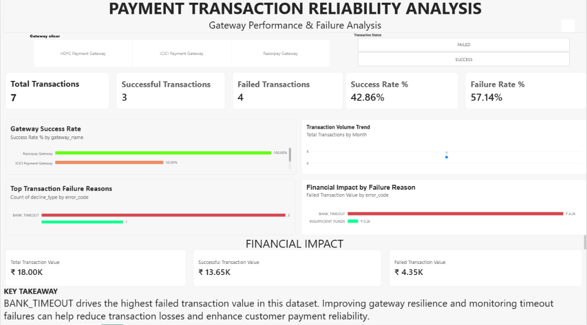

# 💳 FinTech Payment Gateway Reliability & Transaction Monitoring Dashboard

## 🚀 Project Overview

An end-to-end FinTech data analytics project built using **Python, PostgreSQL, and Power BI** to analyze payment transaction reliability, compare gateway performance, identify transaction failure reasons, and evaluate the financial impact of failed payments.

The dashboard connects to PostgreSQL and supports scheduled or manual data refreshes, enabling users to analyze transaction records, track key performance indicators (KPIs), and investigate payment failures through interactive visualizations.

## 🎯 Project Objectives

* Measure total, successful, and failed transactions.
* Calculate transaction success and failure rates.
* Compare payment gateway reliability across Razorpay, ICICI, and HDFC.
* Identify technical and business decline reasons.
* Analyze the financial value associated with successful and failed transactions.
* Build an interactive dashboard to support data-driven decision-making.

## 🛠️ Tech Stack

* **Python:** Transaction data generation, processing, and preparation.
* **PostgreSQL:** Relational database management, data storage, and SQL querying.
* **Power BI:** Interactive dashboard development and business intelligence reporting.
* **DAX:** KPI calculations, transaction metrics, and financial impact measures.
* **Data Connectivity:** PostgreSQL integration with Power BI using scheduled or manual refresh.

## 🔄 Data Analytics Workflow

1. **Data Generation & Processing:** Used Python to generate and prepare transaction data.
2. **Database Management:** Used PostgreSQL to store and query transaction records.
3. **Data Analysis:** Examined transaction statuses, gateway performance, error codes, and transaction amounts.
4. **KPI Development:** Created DAX measures to calculate transaction counts, success rates, failure rates, and transaction values.
5. **Dashboard Development:** Designed interactive Power BI cards, charts, and slicers.
6. **Monitoring & Reporting:** Connected Power BI to PostgreSQL to review transaction performance after data refreshes.

## 📊 Dashboard Features

### 1. Key Performance Indicators (KPIs)

* Total Transactions
* Successful Transactions
* Failed Transactions
* Success Rate (%)
* Failure Rate (%)

### 2. Gateway Reliability Analysis

* Compare transaction success rates across Razorpay, ICICI, and HDFC.
* Explore gateway-specific transaction outcomes using interactive slicers.
* Identify gateways that may require further investigation based on the available data.

### 3. Transaction Failure Analysis

* Analyze failure categories such as `BANK_TIMEOUT` and `INSUFFICIENT_FUNDS`.
* Compare the occurrence and financial impact of transaction failures.
* Distinguish technical failures from business-related declines where the data supports classification.

### 4. Financial Impact Analysis

* Total Transaction Value
* Successful Transaction Value
* Failed Transaction Value
* Failed Transaction Value by Error Category

### 5. Interactive Dashboard Controls

* Payment Gateway slicer
* Transaction Status slicer
* KPI cards and comparative charts
* Failure reason and financial impact visualizations

## 💡 Key Business Insights

* **Transaction Outcomes:** The current sample contains 7 transactions, including 3 successful and 4 failed transactions.
* **Success Rate:** 42.86% of transactions were successful in the sample.
* **Failure Rate:** 57.14% of transactions failed in the sample.
* **Failure Analysis:** `BANK_TIMEOUT` has the highest failed transaction value among the error categories in the current dataset.
* **Gateway Comparison:** Gateway success rates can be compared to identify potential reliability concerns and areas for further investigation.

These findings are specific to the available dataset and should not be generalized to production payment gateway performance.

## 📸 Dashboard Preview

## ⚠️ Project Limitations

* The current dataset contains only seven transactions.
* All transactions are recorded on the same date, limiting time-based analysis.
* Gateway comparisons are illustrative and require a larger dataset for reliable conclusions.
* The dashboard uses refresh-based reporting and should not be interpreted as a live, real-time transaction monitoring system.

## 🔮 Future Improvements

* Expand the dataset with more transactions, dates, and gateway records.
* Analyze failure trends over time.
* Investigate gateway-specific technical errors.
* Add more detailed transaction and customer segmentation where appropriate.
* Automate data preparation and validation using Python.
* Expand SQL analysis and improve dashboard performance.
* Explore more frequent data updates or real-time monitoring architecture.

## 🎓 Skills Demonstrated

* Python for data processing
* PostgreSQL and SQL querying
* Data analysis and validation
* DAX measures and KPI calculations
* Power BI dashboard development
* Data visualization and business reporting
* Translating transaction data into actionable business insights

## 🎯 Project Goal

To demonstrate practical Data Analyst skills by combining Python, SQL, and Power BI to investigate payment transaction reliability, analyze failure patterns, and communicate business insights through an interactive dashboard.

